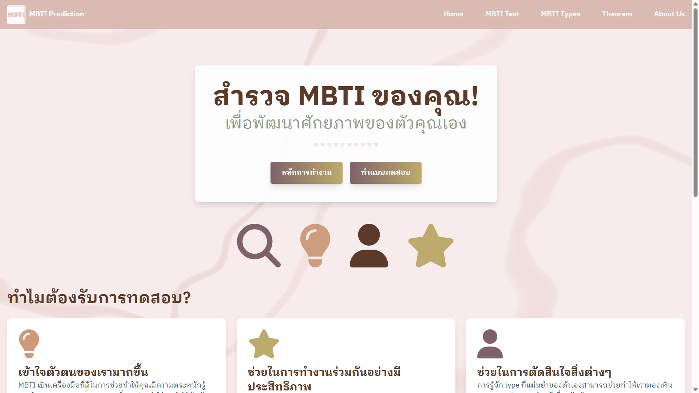
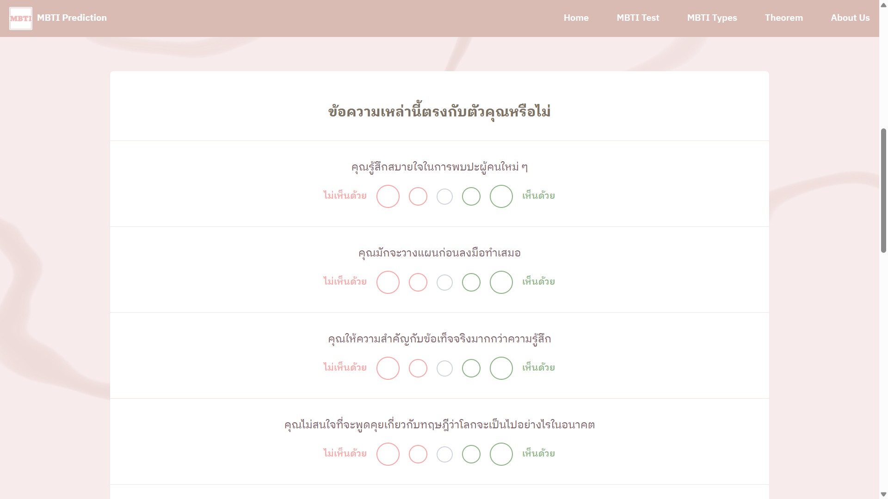
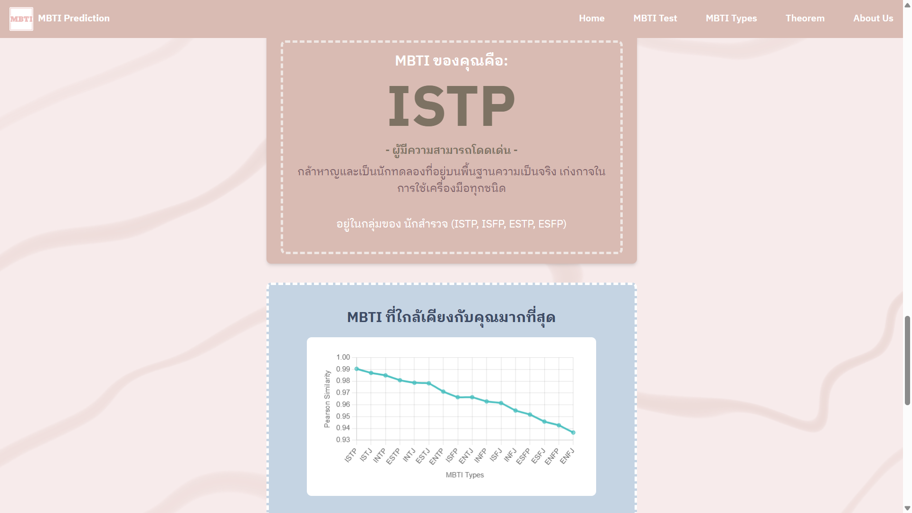

# 👤 MBTI Prediction
A web application that predicts a user’s MBTI personality type by comparing their test responses with existing personality dataset using Pearson similarity.

## 🖼️ Demo




## 🛠️ Tech Stack
- **Frontend:** React, TypeScript, Tailwind CSS  
- **Backend:** Python, FastAPI, Uvicorn

## ✨ Features
- **MBTI Personality Test** – allows users to complete a personality questionnaire.
- **Result Display** – shows the predicted MBTI type along with similarity scores for other types.
- **MBTI Type Information** - provides additional details about each MBTI personality type.
- **Theory Explanation** - provides additional details about the theory used in prediction.

## 🔧 Installation
1. Clone the repository  
   ```bash
   git clone https://github.com/jueeeeeen/MBTI-Prediction.git
   ```
2. Navigate into the frontend folder
    ```bash
   cd MBTI-Prediction
   ```
3. Install dependencies
    ```bash
   pip install -r web_app/backend/requirements.txt
   npm install
   ```

## 🚀 How to Run
1. Start the development server
    #### Backend:
    ```
    cd web_app/backend
    uvicorn backend:app --reload
    ``` 
    #### Frontend:
    ```
    cd web_app/frontend
    npm run dev
    ``` 

2. Open your browser and visit

    ```
    http://127.0.0.1:5173/
    ```
